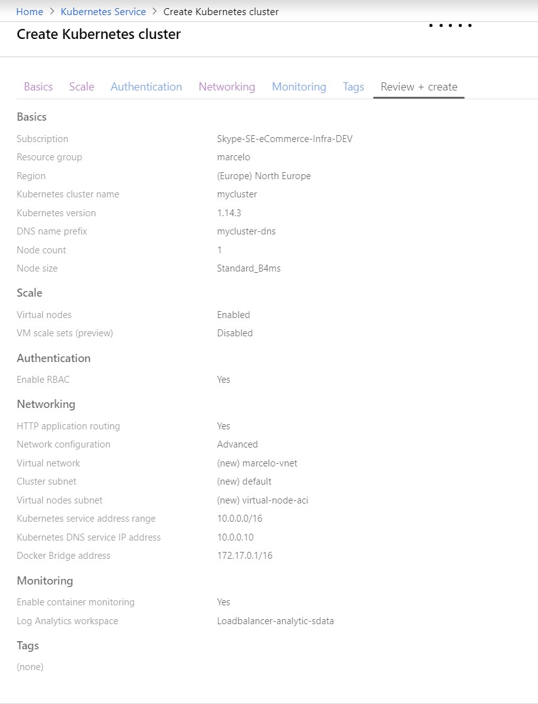
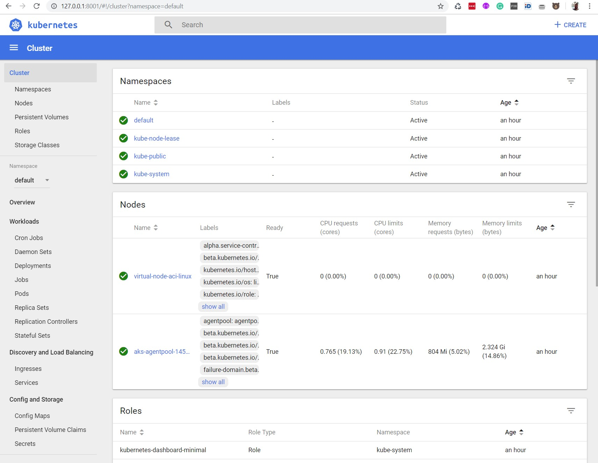

# AKS - Azure Kubernetes Service (example)

This repository contains an example to start a new project using as base AKS.

## Creating an AKS Cluster

AKS cluster can be create using ARM Templates, API, Azure CLI or Web Portal interface. To keep simple was used the Web Portal Interface with a new features deployed on Portal and not supported yet in Azure CLI.



**NOTE:** Remember that is an example to start a new project from scratch to before move to prouction have to analyse how much nodes will be necessary to your goals.

## Azure CLI

To management the AKS Cluster will be necessary to use Azure CLI. If don't have installed, please following this instructions:

* <https://docs.microsoft.com/en-us/cli/azure/install-azure-cli?view=azure-cli-latest>

If it's installed and updated just need run:

```code
$ az login
```

To configure the **kubectl** command will be necessary run:

```code
$ az aks install-cli
Downloading client to "C:\Users\mabarbo\.azure-kubectl\kubectl.exe" from "https://storage.googleapis.com/kubernetes-release/release/v1.15.1/bin/windows/amd64/kubectl.exe"
Please add "C:\Users\mabarbo\.azure-kubectl" to your search PATH so the `kubectl.exe` can be found. 2 options:
    1. Run "set PATH=%PATH%;C:\Users\mabarbo\.azure-kubectl" or "$env:path += 'C:\Users\mabarbo\.azure-kubectl'" for PowerShell. This is good for the current command session.
    2. Update system PATH environment variable by following "Control Panel->System->Advanced->Environment Variables", and re-open the command window. You only need to do it once
```

Getting credentials from the AKS cluster:

```code
$ az aks get-credentials --resource-group marcelo --name mycluster
```

Right now is possible to check the nodes:

```code
$ kubectl get nodes
```

## AKS Dashboard

To open the Kubernetes Dashboard that you can see, in a web interface the deployments, services, status, from your cluster will be necessary enable it:

```code
$ az aks browse --resource-group marcelo --name mycluster
```

The Kubernetes Dashboard will need the permission to interact with it based on the cluster has RBAC enabled:

```code
kubectl create clusterrolebinding kubernetes-dashboard --clusterrole=cluster-admin --serviceaccount=kube-system:kubernetes-dashboard
```

Right now is possible refresh the Kubernetes Dashboard that the errors will disapear.


